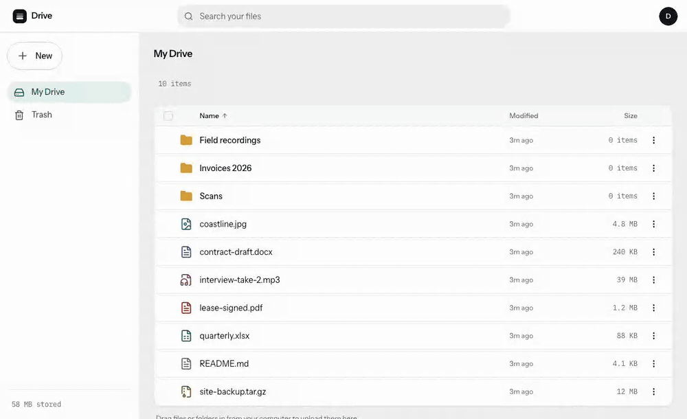

# Drive

A self-hosted file store built around one hard problem: **uploading a very large file over a connection that will not stay up.**

One Go binary serves the API and the React app. File bytes never pass through it — the browser talks straight to S3-compatible object storage over presigned URLs, and the server authorizes, presigns, and keeps the ledger. An interrupted upload resumes from the last part the server confirmed, whether it was interrupted by a dropped connection, a closed tab, or the server process being killed mid-transfer.

**Live:** <https://drive.rahulsharma-cs.site> — a deployment I run and use. **Try it:** sign-up takes thirty seconds, and the verification mail arrives in a few seconds. Accounts get 3 GB, single files up to 2 GB.


## What it does

- **Resumable uploads** over a custom session protocol on S3 multipart: presigned PUTs straight to storage, and a resume sends only what is missing. Pause, resume, cancel and retry per upload, from a manager outside the React tree that navigation never unmounts.
- **Folder drag-and-drop** of whole directory trees, plus a folder picker; name conflicts get keep-both / replace / skip with apply-to-all, so 150 collisions can't stack 150 modals.
- **A file manager, not a list.** Click, shift-click, cmd/ctrl-click and checkboxes select; arrows, Enter, Delete, Esc and cmd/ctrl-A work; the row's kebab menu and its right-click menu come from one definition.
- **A command bar that never moves the list.** Fixed height in every state, crossfading between item count and commands, offering only what the selection can carry out.
- **One `+ New` in the rail** — new folder, upload files, upload folder — landing in the folder you are looking at; name search lives in the URL, so a search is a location, not a mode; on a narrow window the rail folds into a drawer.
- **Move and copy** via a destination picker or by dragging rows onto a folder or a breadcrumb; a copy points at the same stored blob, so it costs a row, not the bytes.
- **Sortable columns and folder counts.** Name, Modified or Size, either direction, folders first, kept in the URL so it survives a reload; a folder row shows a count, not a pretend size.
- **Downloads, and zips built in the browser.** A file is a short-lived presigned GET that forces `Content-Disposition: attachment` on an object stored with no content type, so even a partial response can't render as HTML. A folder or multi-selection is one zip assembled from per-file links — no server-side archive endpoint; Chromium streams it to disk, other browsers build it in memory, and past 1 GB the app offers the files one at a time instead.
- **Previews** for images, video, audio, text and PDF, each at its own URL. What renders inline is a server-side allowlist, never the browser's declared type: SVG and HTML get a download card, not a script on the store's origin.
- **Share links** — one per file, anyone with it can open; optional password, expiry and download limit; revoke or replace any time. Recipients preview images, video, audio and text in the page and download anything.
- **A trash that empties.** Restore or delete forever, from a selection or the whole page; a row that can't go back because its name is taken says so and stays put; empty trash takes everything, not just what's on screen.
- **Sign in with Google or an email and password**, with email verification, Argon2id hashing, durable rate limits and an Argon2 concurrency semaphore; a Google sign-in whose address already has a verified account links to it. (Google shows an "unverified app" notice: the consent screen hasn't been through Google's review.)
- **An account screen:** display name, a password change that signs out every other browser, sessions to revoke or sign out everywhere. Password reset by email is a link that works once, expires in an hour and signs every session out; neither it nor a re-sent verification mail reveals whether an address has an account, and both are rate-limited per IP and per address.
- **Storage limits that bind** — per-file, per-user and service-wide; 2 GB, 3 GB and 8 GB on the deployment above — plus a storage meter in the rail that counts the same bytes the limits do, and hourly garbage collection of unreferenced blobs and abandoned multipart uploads.

## What it does not do

Named plainly, because a portfolio project that overstates itself is worse than a small one:

- **No restricted sharing yet:** links are 'anyone with the link'. No folder links. No permissions beyond the owner and a link holder.
- **No thumbnails.** The list shows a type icon; previews open the file itself.
- **No grid view.**
- **No mobile app, no CLI, no public API tokens.**

Restricted sharing — a link that only named addresses can open — is the next thing worth building. Nothing above is stubbed or half-wired — it is simply not there.

## How the resume actually works

The interesting part is the failure path, so here is the sequence the browser test drives on every run:

1. The client fingerprints the file (name, size, mtime, and both edge blocks) and opens a session; the server hands back presigned part URLs.
2. Parts upload in parallel. The client compares the ETag the store returns against the MD5 it computed for that part and only then confirms it to the server, which records both. **A confirmed part is durable state in Postgres**, not browser memory.
3. The server is killed mid-transfer. The client parks the upload — *"Paused — can't reach the server. Will resume automatically."*
4. The page is reloaded, which destroys the `File` handle for good. The upload manager offers the interrupted session back and asks for **the same file**.
5. Re-picking it re-handshakes: the server merges its ledger with what the store actually holds, and the client sends only the parts neither of them has.
6. On complete, the server checks its ledger against what the store actually holds — every part present, every ETag matching — confirms the assembled object's size, and publishes it. The downloaded bytes hash equal to the source.

Step 5 is why the fingerprint matters: a different file — or the same bytes rewritten, which changes mtime — misses the match and correctly starts a fresh upload rather than silently stitching two files together.



Nothing in that recording is staged: it is a real upload against a real object store, interrupted by a real reload.

## Measured

| What | Result |
| --- | --- |
| 2 GiB upload, Go client → local object store | 205 parts, 41 s (≈77 MiB/s) |
| 11 GiB upload | 1,127 parts, 216 s — past the 1,000-part page boundary, which is the case that breaks naive `ListParts` handling |
| Browser resume after `SIGKILL` mid-transfer | 113 MiB / 12 parts; no confirmed part re-sent; SHA-256 match |
| Production round trip (managed host + cloud object storage) | 220 MiB uploaded and downloaded, SHA-256 match, bytes never touching the app server |

The first three run on one laptop (Apple Silicon, 10 cores, 32 GB) against the local object store in Docker, so they measure the protocol and the hashing pipeline, not a network. The last one is the deployed service.

**Portability, demonstrated rather than claimed:** the same binary and the same upload protocol run against a local S3-compatible store in development and a cloud object store in production. The only difference is environment variables — endpoint, bucket, credentials, signing region.

## Running it

Needs Docker, Go 1.26, and Node 26 (`.nvmrc`).

```sh
make doctor       # preflight: docker, ports, disk, clock skew
make infra-init   # generates .env secrets, starts Postgres + object store + SMTP, creates the bucket
make dev          # API on :8080, Vite on :5173
```

`make infra-init` refuses any object-store endpoint that isn't loopback or the local compose service, so it cannot be aimed at a real bucket by accident.

Tests:

```sh
make test         # Go suite against an isolated test stack
make e2e          # Playwright
make e2e-resume   # the kill-the-server-mid-upload proof above
cd web && npx vitest run   # the web suite: the upload engine and the screens
```

The dev and test stacks are separate Docker projects on separate ports, so running tests never touches development data.

## Architecture

```
server/
  cmd/drive          the one binary: API, migrations, GC ticker, embedded SPA
  internal/api       routes, auth middleware, CSRF, rate limiting
  internal/upload    session protocol, presigning, part ledger, finalize
  internal/blob      S3 client
  internal/node      folders, files, trash, search
  internal/gc        unreferenced blobs and abandoned multipart uploads
  internal/uploadclient  importable Go client for the upload protocol
web/src/features/upload/engine   the browser upload engine
```

- **Postgres owns all metadata**, including the resume ledger. Migrations are embedded in the binary, and an applied one is never rewritten — a schema change gets a new numbered file.
- **The upload engine is a pure state machine** with clock, RNG, XHR, IndexedDB and web locks all injected, so its test suite is deterministic by construction and needs no browser.
- **The SPA is embedded in the binary** (`go:embed`), which is what lets cookies stay `SameSite=Lax` with no cross-origin credentialed CORS anywhere.

## Testing standard

A green suite was not treated as evidence. Every test that counts was shown to **fail** with the production behavior deliberately broken, then restored — because two adversarial reviews of this codebase each found real defects, including vacuous tests, in code that was 100% green.

## License

MIT. See [LICENSE](LICENSE).
