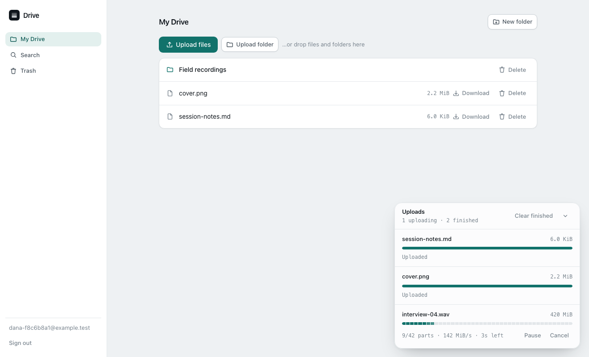

# Drive

A self-hosted file store built around one hard problem: **uploading a very large file over a connection that will not stay up.**

One Go binary serves the API and the React app. File bytes never pass through it — the browser talks straight to S3-compatible object storage over presigned URLs, and the server authorizes, presigns, and keeps the ledger. An interrupted upload resumes from the last part the server confirmed, whether it was interrupted by a dropped connection, a closed tab, or the server process being killed mid-transfer.

**Live:** <https://drive.rahulsharma-cs.site> — signups are closed while this is a single-operator deployment.



## What it does

- **Resumable uploads.** A custom session protocol over S3 multipart: create a session, PUT parts directly to storage with presigned URLs, confirm each part against its MD5, complete. Resume re-handshakes and re-sends only what is missing.
- **Pause, resume, cancel, retry** per upload, from a manager that lives outside the React tree — navigating between folders never interrupts a transfer.
- **Folder drag-and-drop** (full directory trees) plus a folder picker, both normalized through the same traversal.
- **Name conflicts** resolved with keep-both / replace / skip, one prompt per bulk drop rather than one per file.
- **Accounts** with email verification, Argon2id password hashing, durable rate limits and an Argon2 concurrency semaphore.
- **Folders, trash with restore and purge, name search, downloads** through short-lived presigned GETs that always answer `Content-Disposition: attachment`.
- **Garbage collection** of unreferenced blobs and abandoned multipart uploads, on an in-process hourly ticker with a pass at startup.
- **Storage limits** that actually bind: a per-file maximum, a per-user quota, and a service-wide stored-bytes cap checked before a session is created.

## What it does not do

Named plainly, because a portfolio project that overstates itself is worse than a small one:

- **No sharing.** No share links, no public pages, no permissions beyond "the owner". The schema has tables for it; there are no endpoints and no UI.
- **No previews or thumbnails.** Files go in and come out as bytes.
- **No password reset**, no session management screen, no move/copy/rename in the UI, no grid view, no multi-select.
- **No mobile app, no CLI, no public API tokens.**

Sharing and previews are the next things worth building. Nothing above is stubbed or half-wired — it is simply not there.

## How the resume actually works

The interesting part is the failure path, so here is the sequence the browser test drives on every run:

1. The client fingerprints the file (name, size, mtime, and both edge blocks) and opens a session; the server hands back presigned part URLs.
2. Parts upload in parallel. Each finished part is confirmed to the server, which checks the storage's ETag against the client's MD5 before recording it. **A confirmed part is durable state in Postgres**, not browser memory.
3. The server is killed mid-transfer. The client parks the upload — *"Paused — can't reach the server. Will resume automatically."*
4. The page is reloaded, which destroys the `File` handle for good. The upload manager offers the interrupted session back and asks for **the same file**.
5. Re-picking it re-handshakes: the server merges its ledger with what the store actually holds, and the client sends only the parts neither of them has.
6. On complete, the server checks its ledger against what the store actually holds — every part present, every ETag matching — confirms the assembled object's size, and publishes it. The downloaded bytes hash equal to the source.

Step 5 is why the fingerprint matters: a different file — or the same bytes rewritten, which changes mtime — misses the match and correctly starts a fresh upload rather than silently stitching two files together.

## Measured

| What | Result |
| --- | --- |
| 2 GiB upload, Go client → local object store | 205 parts, 41 s (≈77 MiB/s) |
| 11 GiB upload | 1,127 parts, 216 s — past the 1,000-part page boundary, which is the case that breaks naive `ListParts` handling |
| Browser resume after `SIGKILL` mid-transfer | 113 MiB / 12 parts; no confirmed part re-sent; SHA-256 match |
| Production round trip (managed host + cloud object storage) | 220 MiB uploaded and downloaded, SHA-256 match, bytes never touching the app server |

The first three run on one laptop (Apple Silicon, 10 cores, 32 GB) against the local object store in Docker, so they measure the protocol and the hashing pipeline, not a network. The last one is the deployed service.

**Portability, demonstrated rather than claimed:** the same binary and the same upload protocol run against a local S3-compatible store in development and a cloud object store in production. The only difference is environment variables — endpoint, bucket, credentials, signing region.

## Running it

Needs Docker, Go 1.26, and Node 26 (`.nvmrc`).

```sh
make doctor       # preflight: docker, ports, disk, clock skew
make infra-init   # generates .env secrets, starts Postgres + object store + SMTP, creates the bucket
make dev          # API on :8080, Vite on :5173
```

`make infra-init` refuses to point at anything but localhost, so it cannot be aimed at a real bucket by accident.

Tests:

```sh
make test         # Go suite against an isolated test stack
make e2e          # Playwright
make e2e-resume   # the kill-the-server-mid-upload proof above
cd web && npx vitest run   # the upload engine's own suite
```

The dev and test stacks are separate Docker projects on separate ports, so running tests never touches development data.

## Architecture

```
server/
  cmd/drive          the one binary: API, migrations, GC ticker, embedded SPA
  internal/api       routes, auth middleware, CSRF, rate limiting
  internal/upload    session protocol, presigning, part ledger, finalize
  internal/blob      S3 client
  internal/node      folders, files, trash, search
  internal/gc        unreferenced blobs and abandoned multipart uploads
  internal/uploadclient  importable Go client for the upload protocol
web/src/features/upload/engine   the browser upload engine
```

- **Postgres owns all metadata**, including the resume ledger. Migrations are embedded and never edited after they ship.
- **The upload engine is a pure state machine** with clock, RNG, XHR, IndexedDB and web locks all injected, so its test suite is deterministic by construction and needs no browser.
- **The SPA is embedded in the binary** (`go:embed`), which is what lets cookies stay `SameSite=Lax` with no cross-origin credentialed CORS anywhere.

## Testing standard

A green suite was not treated as evidence. Every test that counts was shown to **fail** with the production behavior deliberately broken, then restored — because two adversarial reviews of this codebase each found real defects, including vacuous tests, in code that was 100% green.

## License

MIT. See [LICENSE](LICENSE).
